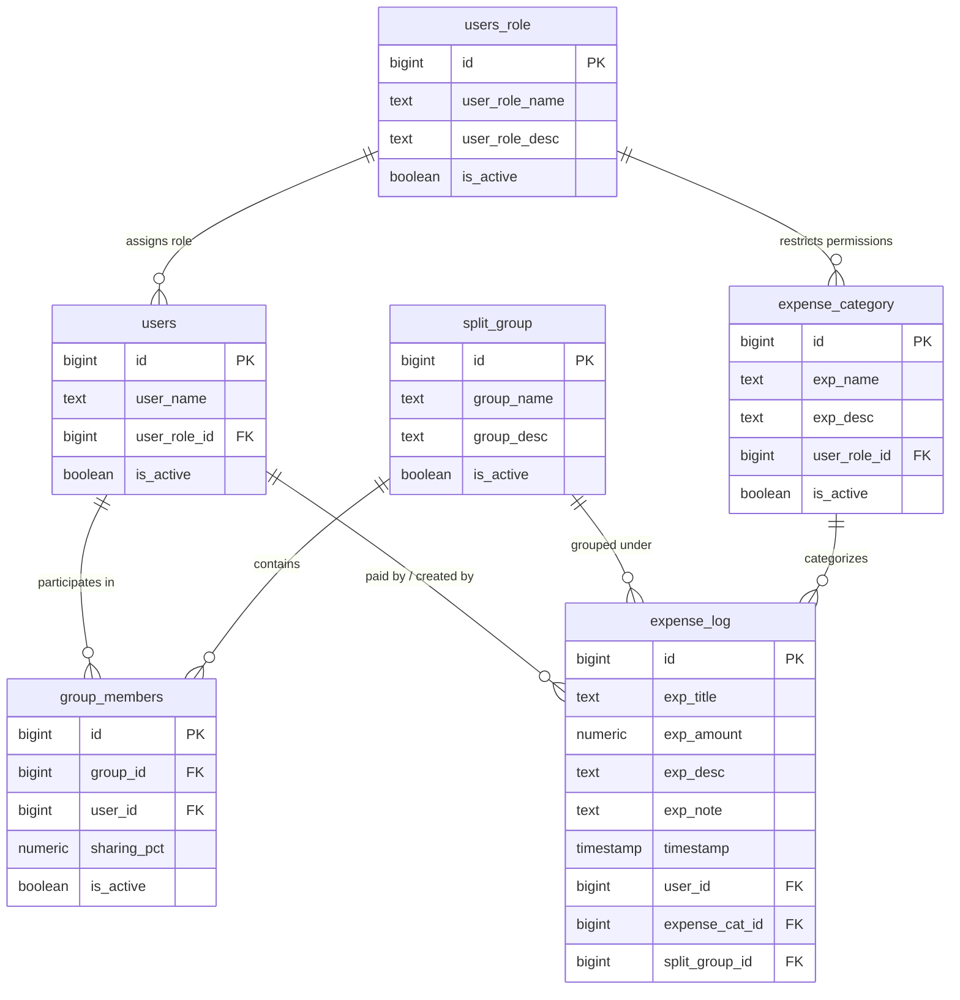

<<<<<<< HEAD
# ➗ SplitKaro Pro - Smart Expense Splitting & Settlement Application

> **A full-stack, production-ready expense splitting application built with Next.js (App Router), Node.js REST APIs, and Supabase (PostgreSQL) based on a 6-table relational database architecture.**

---

## 📖 Overview (Project Kya Hai?)

**SplitKaro Pro** ek modern relational expense-sharing web application hai jo dosto, roommates, flatmates aur trip groups ke beech shared kharche (expenses) calculate aur settle karne ke liye banayi gayi hai.

Yeh app **strictly 6-table relational database schema** par kaam karti hai, jisme har entity (Users, Roles, Groups, Memberships, Categories, Expense Transactions) Supabase PostgreSQL database ke sath synchronized rehti hai.

---

## 🏗️ Architecture & Database Workflow

App 3 core layers par kaam karti hai:
1. **Frontend (UI Layer)**: Next.js 16, React 19, Tailwind CSS, Lucide-styled micro-interactions, responsive dark/light theme.
2. **Backend API (REST Layer)**: Next.js App Router API Route Handlers (`/api/*`) jo business logic, data joins, aur validations handle karte hain.
3. **Database (Persistence Layer)**: Supabase PostgreSQL relational database with Row Level Security (RLS) and Foreign Key integrity.

```mermaid
graph TD
    UI[🖥️ Next.js React Frontend<br/>SplitForm.tsx / Live Settlement] -->|Fetch REST APIs| API[⚡ Node.js REST API Routes<br/>/api/groups, /api/expenses, /api/users, /api/categories]
    API -->|@supabase/supabase-js Client| DB[(🐘 Supabase PostgreSQL<br/>6-Table Relational Schema)]
    
    subgraph PostgreSQL Database Schema
        DB --> T1[1. users_role]
        DB --> T2[2. users]
        DB --> T3[3. expense_category]
        DB --> T4[4. split_group]
        DB --> T5[5. group_members]
        DB --> T6[6. expense_log]
    end
```

---

## 🗄️ The 6-Table Relational Database Schema



### Table Breakdown:

| # | Table Name | Purpose / Kaam | Key Fields |
| :--- | :--- | :--- | :--- |
| 1 | **`users_role`** | System roles define karta hai | `id`, `user_role_name` (*Admin, Member, Guest*), `is_active` |
| 2 | **`users`** | Application ke users aur participants | `id`, `user_name`, `user_role_id` &rarr; `users_role(id)` |
| 3 | **`expense_category`** | Categories (Food, Travel, Rent, Party, etc.) | `id`, `exp_name`, `exp_desc`, `user_role_id` |
| 4 | **`split_group`** | Trips, Flats, ya Events groups (*Goa Trip 🌴*) | `id`, `group_name`, `group_desc`, `is_active` |
| 5 | **`group_members`** | Junction table jo users ko group me custom **Sharing %** ke sath jodti hai | `group_id` &rarr; `split_group(id)`, `user_id` &rarr; `users(id)`, `sharing_pct` |
| 6 | **`expense_log`** | Transaction ledger jo har bill, amount, title, description, payer aur group ko record karta hai | `exp_title`, `exp_amount`, `exp_desc`, `exp_note`, `user_id`, `expense_cat_id`, `split_group_id` |

---

## ✨ Key Features (App Kya-Kya Karti Hai?)

1. **Smart Bill Splitting with Paisa Precision Math**:
   - **Equal Split**: Remainder paisa distribution ke sath exact distribution (koi rounding issue nahi).
   - **Custom Percentage Split**: Har member ke liye customized percentage share specify karne ki suvidha.

2. **Full Group & Membership Lifecycle**:
   - Naya group banayein (`split_group`), description dalein.
   - Dynamic member builder: Naye members add karein, sharing percentage allocate karein, aur `⚖️ Equalize %` button se 100% auto-balance karein.
   - Group totals aur spending aggregates live track hote hain.

3. **Role-Based Category Management**:
   - Custom expense categories add karein (`exp_name` & `exp_desc`).
   - Categories ko user roles ke sath link kiya ja sakta hai.

4. **Live In-App Database Explorer**:
   - Application ke andar hi live 6-table database viewer hai jahan aap `expense_log`, `group_members`, `split_group`, `users`, `users_role`, aur `expense_category` ke live rows inspect aur delete kar sakte hain.

5. **1-Click WhatsApp & Clipboard Sharing**:
   - Settle hone ke baad single click me WhatsApp pe formatted message ya summary copy karke share karein.

6. **1-Click Sample DB Seed**:
   - Single click me complete demo dataset (Admin, Rahul, Priya, Goa Trip group, members, categories) initialize karne ki capability.

---

## 🔌 API Endpoints Summary

| Method | Endpoint | Description |
| :--- | :--- | :--- |
| `GET` / `POST` | `/api/roles` | Fetch all roles / Create new user role |
| `GET` / `POST` | `/api/users` | Fetch users with joined role / Create user |
| `GET` / `POST` | `/api/categories` | Fetch categories with role mapping / Create category |
| `GET` / `POST` / `DELETE` | `/api/groups` | Fetch groups with members & spent totals / Create group / Delete group |
| `GET` / `POST` / `DELETE` | `/api/group-members` | Fetch memberships / Assign user to group with % / Remove member |
| `GET` / `POST` / `DELETE` | `/api/expenses` | Fetch expenses with relational joins / Log new expense / Delete expense |
| `POST` | `/api/seed` | Seed initial database dataset across all 6 tables |

---

## 🚀 Quick Start Guide (Kaise Run Karein?)

### 1. Repository Clone & Dependencies Install
```bash
git clone https://github.com/mauryasapna/splitexpense.git
cd splitexpense
npm install
```

### 2. Environment Variables Setup
Create a `.env` file in the root directory:
```env
NEXT_PUBLIC_SUPABASE_URL=https://your-supabase-project.supabase.co
NEXT_PUBLIC_SUPABASE_ANON_KEY=your-supabase-anon-key
```

### 3. Database Setup (Supabase SQL)
Supabase Dashboard ke **SQL Editor** me jakar yeh schema script execute karein:

```sql
-- 1. users_role
CREATE TABLE IF NOT EXISTS public.users_role (
  id BIGINT GENERATED BY DEFAULT AS IDENTITY PRIMARY KEY,
  user_role_name TEXT NOT NULL,
  user_role_desc TEXT,
  is_active BOOLEAN DEFAULT true
);

-- 2. users
CREATE TABLE IF NOT EXISTS public.users (
  id BIGINT GENERATED BY DEFAULT AS IDENTITY PRIMARY KEY,
  user_name TEXT NOT NULL,
  user_role_id BIGINT REFERENCES public.users_role(id) ON DELETE SET NULL,
  is_active BOOLEAN DEFAULT true
);

-- 3. expense_category
CREATE TABLE IF NOT EXISTS public.expense_category (
  id BIGINT GENERATED BY DEFAULT AS IDENTITY PRIMARY KEY,
  exp_name TEXT NOT NULL,
  exp_desc TEXT,
  user_role_id BIGINT REFERENCES public.users_role(id) ON DELETE SET NULL,
  is_active BOOLEAN DEFAULT true
);

-- 4. split_group
CREATE TABLE IF NOT EXISTS public.split_group (
  id BIGINT GENERATED BY DEFAULT AS IDENTITY PRIMARY KEY,
  group_name TEXT NOT NULL,
  group_desc TEXT,
  is_active BOOLEAN DEFAULT true
);

-- 5. group_members
CREATE TABLE IF NOT EXISTS public.group_members (
  id BIGINT GENERATED BY DEFAULT AS IDENTITY PRIMARY KEY,
  user_id BIGINT REFERENCES public.users(id) ON DELETE CASCADE,
  group_id BIGINT REFERENCES public.split_group(id) ON DELETE CASCADE,
  sharing_pct NUMERIC(5,2) DEFAULT 0,
  is_active BOOLEAN DEFAULT true
);

-- 6. expense_log
CREATE TABLE IF NOT EXISTS public.expense_log (
  id BIGINT GENERATED BY DEFAULT AS IDENTITY PRIMARY KEY,
  expense_cat_id BIGINT REFERENCES public.expense_category(id) ON DELETE SET NULL,
  user_id BIGINT REFERENCES public.users(id) ON DELETE SET NULL,
  split_group_id BIGINT REFERENCES public.split_group(id) ON DELETE CASCADE,
  timestamp TIMESTAMPTZ DEFAULT NOW(),
  exp_title TEXT NOT NULL,
  exp_desc TEXT,
  exp_note TEXT,
  exp_amount NUMERIC(10,2) NOT NULL
);

-- Enable RLS & Add Public Policies
ALTER TABLE public.users_role ENABLE ROW LEVEL SECURITY;
ALTER TABLE public.users ENABLE ROW LEVEL SECURITY;
ALTER TABLE public.expense_category ENABLE ROW LEVEL SECURITY;
ALTER TABLE public.split_group ENABLE ROW LEVEL SECURITY;
ALTER TABLE public.group_members ENABLE ROW LEVEL SECURITY;
ALTER TABLE public.expense_log ENABLE ROW LEVEL SECURITY;

CREATE POLICY "public_users_role" ON public.users_role FOR ALL USING (true) WITH CHECK (true);
CREATE POLICY "public_users" ON public.users FOR ALL USING (true) WITH CHECK (true);
CREATE POLICY "public_expense_category" ON public.expense_category FOR ALL USING (true) WITH CHECK (true);
CREATE POLICY "public_split_group" ON public.split_group FOR ALL USING (true) WITH CHECK (true);
CREATE POLICY "public_group_members" ON public.group_members FOR ALL USING (true) WITH CHECK (true);
CREATE POLICY "public_expense_log" ON public.expense_log FOR ALL USING (true) WITH CHECK (true);

NOTIFY pgrst, 'reload schema';
```

### 4. Development Server Run Karein
```bash
npm run dev
```
Open [http://localhost:3000](http://localhost:3000) in your browser.

---

## 🛠️ Tech Stack

- **Framework**: Next.js 16 (App Router with Turbopack)
- **Language**: TypeScript 5
- **UI Library**: React 19, Tailwind CSS 4
- **Database & Backend**: Supabase (PostgreSQL), PostgREST
- **Deployment**: Vercel-ready

---

## 📄 License
This project is open-source and available under the [MIT License](LICENSE).
=======
This is a [Next.js](https://nextjs.org) project bootstrapped with [`create-next-app`](https://nextjs.org/docs/app/api-reference/cli/create-next-app).

## Getting Started

First, run the development server:

```bash
npm run dev
# or
yarn dev
# or
pnpm dev
# or
bun dev
```

Open [http://localhost:3000](http://localhost:3000) with your browser to see the result.

You can start editing the page by modifying `app/page.tsx`. The page auto-updates as you edit the file.

This project uses [`next/font`](https://nextjs.org/docs/app/building-your-application/optimizing/fonts) to automatically optimize and load [Geist](https://vercel.com/font), a new font family for Vercel.

## Learn More

To learn more about Next.js, take a look at the following resources:

- [Next.js Documentation](https://nextjs.org/docs) - learn about Next.js features and API.
- [Learn Next.js](https://nextjs.org/learn) - an interactive Next.js tutorial.

You can check out [the Next.js GitHub repository](https://github.com/vercel/next.js) - your feedback and contributions are welcome!

## Deploy on Vercel

The easiest way to deploy your Next.js app is to use the [Vercel Platform](https://vercel.com/new?utm_medium=default-template&filter=next.js&utm_source=create-next-app&utm_campaign=create-next-app-readme) from the creators of Next.js.

Check out our [Next.js deployment documentation](https://nextjs.org/docs/app/building-your-application/deploying) for more details.
>>>>>>> 17c8f85 (Initial commit from Create Next App)
